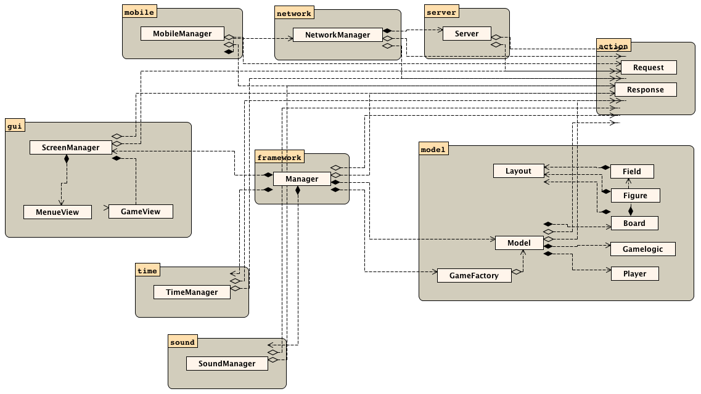
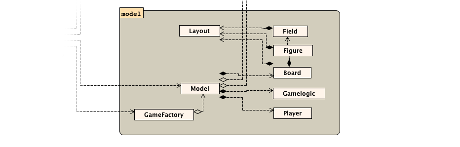

# The-Game-Brett
Teamprojekt Hochschule Trier 2015-2016
Java-basiertes Framework zur Erstellung eines interaktiven Spielbretts für Multitouch-Geräte
von Kore Kaluzynski, Cenk Saatci, Christian Colbach

## Installation und Ausführung der Anwendung
<p>
Zur Erstellung einer ausführbaren Datei muss das <em>src</em> Verzeichnis kompiliert werden.
Die Hauptklasse der Anwendung ist die Klasse <em>thegamebrett.gui.GUIApplication</em>. Dieser muss zur Ausführung ein Parameter übergeben werden, welcher inklusive <code>/</code> den absoluten Pfad des Assetsordners angibt. Dieser Ordner ist in <em>scr/assetsfolder</em> zu finden und kann in ein beliebiges Verzeichnis im Dateisystem verschoben werden:
</p>
##### Beispiel zum Start der Anwendung:
<pre>
$ java thegamebrett.gui.GUIApplication /Users/grompa/Documents/gamebrett/classes/assetsfolder/
</pre>

## Aufbau des Frameworks

<em>Prinzipieller Aufbau des Projektes</em>

### Model View Controller
Mit einer Trennung zwischen Spielelogik und <code>I/O</code> war es möglich, das Framework stark MVC-orientiert umzusetzen. Dies hat den Vorteil dass die einzelnen Spiele komplett austauschbar sind, ohne dass dafür eine Zeile Code im Rest des Systems geändert werden muss.

#### Der Manager (Controller)
<p>
    Der Manager stellt sozusagen den "Dreh und Angelpunkt" der Anwendung dar. Über ihn laufen alle Kommunikationen und er dient als Verbindungsglied aller Komponenten (direkt oder indirekt).
</p>

#### Grafik (View #1)
<p>
    Die Grafische Benutzeroberfläche welche auf dem Gerät selbst angezeigt wird setzt auf JavaFX. Der Aufbau wechselt lediglich zwischen zwei <em>Scenes</em>. Der <code>MenueView</code> und der <code>GameView</code>, welche den Kern der Benutzeroberfläche darstellen.
</p>
<p>
    Die <code>MenueView</code> stellt die erste <em>Scene</em> dar. Diese wird beim Start der Anwendung gesetzt und dient zur Darstellung des Menüs, sowie zur Auswahl der vorhandenen Spiele. Zur direkten Funktion wird sie jedoch nicht benötigt (auch wenn sie diese ergänzt) da die Funktionen nicht auf die direkte Eingabe am Gerät angewiesen ist (Mehr dazu unter <em>Steuerungskonzept</em>).
</p>
<p>
    Die <code>GameView</code> stellt die zweite <em>Scene</em> dar. Sie ist generisch und stellt immer das aktuelle Spiel dar. Die einzelnen Spiele werden in ihr geladen und auch animiert (Bewegung von Figuren und Feldern).
</p>

#### Webinterface (View #2)
<p>
    Das <em>Webinterface</em> verkörpert in unserem Aufbau die Grundlage aller Kommunikationen mit dem Spieler. Jeder Spieler muss sich über sein Smartphone (bzw. einem anderen internetfähigen Gerät) an den Server anmelden, welcher als Verbingung zur Interaktion mit dem System und damit auch mit dem Spiel dient.
</p>

#### Spielelogik (Model #1)
<p>
    Die <em>Spielelogik</em> und die dazugehörigen Klassen des <em>Models</em> stellen das Spiel im Eigentlichen dar. Sie ist komplett austauschbar und kann selbst zur Laufzeit beliebig oft ausgetauscht werden. Dies ermöglicht es den Spielern sich gemeinsam für ein Spiel zu entscheiden und dieses anschliessend zu spielen.
</p>

#### Userstate (Model #2)
<p>
    Die am System angemeldeten User werden vom Usermanager verwaltet. Jeder Spieler erhält einen wählbaren Sitzplatz und einen dazugehörigen wählbaren Character.
</p>

#### Kommunikation zwischen einzelnen Modulen
<p>
    Die Komunikation zwischen den einzelnen Modulen (Model, Grafik, Webinterface, Spielelogik) findet über einen selbst implementiertes System aus <em>Actions</em> statt. Grundlage hierfür stellen die Interfaces <code>ActionRequest</code> und <code>ActionResponse</code> von welchen es eine bestimmte Menge von Implementierungen gibt, welche durch das gesamte System durchgereicht werden. Hierbei leitet der Manager kontinuierlich <em>Requests</em> von der Spielelogik an die gewünschte Systemkomponente weiter (z.B. Netzwerk oder UI). Diese Systemkomponenten generieren anschliessend die passende <em>Responses</em> welche danach wieder an den Manager übergeben werden. Hirbei ist zu beachten dass die Spielelogik immer nur beim "Anstoss" durch den Manager aktiv wird und ihre nächste <em>Request</em> generiert. Ein solcher Anstoss geschieht nur wenn eine <em>Response</em> an die Spielelogik zurück geht. Um diesen Aufbau zu verstehen sind folgende Methoden relevant:
</p>
In der Spielelogik (<code>Gamelogik</code>):
```java
public ActionRequest[] next(ActionResponse as);
````
In dem Manager (<code>Manager</code>, <code>MobileManager</code>, <code>TimeManager</code>, <code>NetworkManager</code>):
```java
public void react(ActionResponse response);
````

### Steuerungskonzept
<p>
    Das Brett ist so konzipiert dass eine Steuerung mittels Maus oder Touchscreen nicht nötig ist. Es genügt wenn das Spielbrett mit dem WLAN verbunden ist, beziehungsweise einen eingebauten Access Point enthält. Das Menü und die Spiele werden über die externen Geräte, welche mit dem Brett verbunden sind, gesteuert.
</p>

### Assets
<p>
    Zum Laden von Assets wird die Klasse <code>AssetLoader</code> verwendet, welche das Laden von Inhalten und lokalisierten Textdokumenten vereinfacht (Mehr dazu im nächsten Abschnitt Lokalisierung).
</p>

### Lokalisierung
<p>
    Für die Lokalisierung unserer Anwendung verwenden wir das Java-eigene Lokalisierungsframework <code>java.util.ResourceBundle</code>. Dieses erlaubt es sprachunabhängige Strings zu definieren und diese anschliessend in verschiedene Sprachen zu übersetzen.
</p>

#### Verwendung durch den Endbenutzer
<p>
    Die Einstellung der Sprache kann in der UI im Menu vorgenommen werden. Hierzu klickt man auf den Button [Optionen] und stellt diese anschließend unter den Spracheinstellungen ein.
</p>

#### Verwendung durch den Programmierer
<p>
    Bei der Verwendung unterscheiden wir im Folgenden zwischen der Lokalisierung des Java-Codes und der Lokalisierung der HTML-Seiten. Hierzu ist außerdem zu erwähnen, dass alle Strings welche verwendet werden sollen, in den entsprechenden <code>properties</code>-Dateien angegeben sein müssen. Für Englisch beispielsweise in der Datei <code>languages_en.properties</code>, für Deutsch <code>languages_de.properties</code>.
</p>

##### Java
<p>
    In Java können Strings durch die direkte Verwendung des <code>ResourceBundle</code>-Objektes lokalisiert werden. Dieses ist statisch und befindet sich im Manager. Es kann durch <code>Manager.rb</code> angesprochen werden. <code>ResourceBundle</code> besitzt eine Funktion <code>getString(String)</code>, diese Methode gibt bei Angabe eines Keys einen entsprechend lokalisierten String zurück.
</p>
<em>Beispiel:</em> <br>
```java
System.out.println(Manager.rb.getString("StartGame"));
```
Gibt als Ausgabe <code>Spiel beitreten</code> zurück wenn die Sprache auf Deutsch gestellt ist und <code>Join game</code> wenn die Sprache auf Englisch gestellt ist.

##### HTML
<p>
    Zur Lokalisierung der HTML-Seiten verwenden wir ein eigenes System welches durch unseren AssetsLoader realisiert wird. Dieser durchsucht die Dateien On-the-fly nach dem Vorkommen dieser Symbole <code>##</code> und ersetzt den zwischen diesen Symbolen vorkommenden Text durch den passenden Eintrag im <code>ResourceBundle</code>.
</p>
<em>Beispiel:</em>

```html
##JoinGame## 
```
Wird beim Laden automatisch ersetzt durch: <code>Spiel beitreten</code> wenn die Sprache auf Deutsch gestellt ist und durch <code>Join game</code> wenn die Sprache auf Englisch gestellt ist.

<p>
    Bei der Verwendung dieser Art der Lokalisierung ist darauf zu achten, dass auf diese Weise __nur__ die HTML-Seiten welche durch unseren AssetsLoader geladen werden (also als Datei von der Festplatte) lokalisiert werden! Sämtliche anderen Strings welche dem Server per Java-Code übergeben werden __müssen__ wie im vorherigen Punkt beschrieben lokalisiert werden.
</p>

## Erstellung eigener Spiele
<p>
    Da unser Framework sehr generisch gehalten ist können neue Spiele mit wenig Aufwand erstellt werden.
</p>
### Aufbau

<em>Prinzipieller Aufbau des Models</em>
<p>
    Im Paket <code>thegamebrett.model</code> sind die Klassen zusammengefasst, auf welchen die Spiele basieren müssen damit das Framework mit ihnen arbeiten kann.
</p>

#### Model
Klasse: <code>thegamebrett.model.Model</code>
<p>
    Die Klasse Model ist die einzige Klasse über die der <em>Manager</em> auf das Spiel zugreift und unter welcher die weiteren Klassen des Spieles organisiert sind. Es ist nicht nötig (aber erlaubt) von ihr abzuleiten. Objekte dieser Klasse werden innerhalb der <code>GameFactory</code>-Klasse erzeugt.
</p>

#### Player
Abstrakte Klasse: <code>thegamebrett.model.Player</code>
<p>
    Die Klasse Player ist die Klasse welche einen Spieler im Spiel repräsentiert. Sie ist abstrakt, obwohl sie keine abstrakten Methoden enthält und muss somit vererbt werden. Der Grund hierfür ist dass die Logik, welche dem Spieler die Figuren zuordnet, in dieser Klasse bestimmt werden soll. Die Zuordnung von Figuren kann entweder berechnet werden indem die Methode <code>public Figure[] getFigures();</code> überschrieben wird oder indem die ArrayList <code>ArrayList<Figure> figures</code> befüllt wird.
</p>

#### Elemente
##### Element
Abstrakte Klasse: <code>thegamebrett.model.elements.Element</code>
<p>
    Diese Klasse dient als Vater aller Komponenten welche die UI zeichnen kann. <code>Element</code> erweitert alle Klassen um eine Funktion <code>public void registerChange()</code> diese Funktion muss zwingend aufgerufen werden wenn eine Eigenschaft der Klasse verändert wird welche für die UI interessant sein könnte. Wird diese Funktion __nicht__ aufgerufen, werden die vom Model abhängigen UI-Komponenten auch __nicht__ aktualisiert.
</p>

##### Koordinatensystem
<p>
    Bevor wir auf den Aufbau der einzelnen <em>Elemente</em> eingehen gibt es noch ein paar Dinge zu beachten, welche sich auf das verwendete Koordinatensystem beziehen. Der Bereich der Koordinaten reicht von 0 bis 1. Der Punkt der sich unten rechts befindet ist also <em>(1, 1)</em> und der Punkt welcher sich oben links befindet ist <em>(0, 0)</em>. Hierbei zu beachten ist, dass dies nicht dem Punkt <em>(0, 0)</em> des Displays entsprechen muss. Mehr dazu im folgendem Abschnitt über die Klasse <code>Board</code>.
</p>

##### Board
Abstrakte Klasse: <code>thegamebrett.model.elements.Board</code>
<p>
    Diese Klasse repräsentiert im Model das Spielbrett im eigentlichen Sinne, also die Unterlage auf der sich die Felder und die Figuren befinden. Die Klasse ist abstrakt und muss somit zwingend vererbt werden. Zusätzlich müssen folgende Methoden implementiert werden:
</p>

Soll die Anzahl der Felder zurückgegeben werden welche sich auf dem Brett befinden:
```java
public abstract int getFieldLength();
```

Soll das Feld mit dem index i zurückgeben werden:
```java
public abstract Field getField(int i);
```

Soll das Layout des Bretts zurückgeben werden (später mehr dazu):
```java
public abstract Layout getLayout();
```

Soll die Ratio des Brettes zurückgeben werden. Das Verhältnis zwischen X und Y gibt das Verhältnis zwischen Breite und Höhe an. Ein Ratio 1 zu 1 entspricht einem Quadratischen Spielfeldes. Das Koordinatensystem ist von dieser Angabe abhängig:
```java
public abstract float getRatioX();
public abstract float getRatioY();
```

##### Field
Abstrakte Klasse: <code>thegamebrett.model.elements.Field</code>
<p>
    Diese Klasse repräsentiert im Model ein Spielfeld. Die Klasse ist abstrakt und muss somit zwingend vererbt werden. Zusätzlich müssen folgende Methoden implementiert werden:
</p>

Soll die relative horizontale und vertikale Position zurück geliefert werden:
```java
public abstract RelativePoint getRelativePosition();
```

Soll die relative Breite zurückgeben werden (Wert ∈ [0d, 1d]):
```java
public abstract double getWidthRelative();
```

Soll die relative Höhe zurückgeben werden (Wert ∈ [0d, 1d]):
```java
public abstract double getHeightRelative();
```

Soll das nächste Feld zurückgeben werden:
```java
public abstract Field[] getNext();
```

Soll das vorhergehendes Feld zurückgeben werden:
```java
public abstract Field[] getPrevious();
```

Soll das Layout des Feldes zurückgeben werden (später mehr dazu):
```java
public abstract Layout getLayout();
```

##### Figure
Klasse Figure: <code>thegamebrett.model.elements.Figure</code>
<p>
    Die Klasse <code>Figure</code> ist die Klasse welche im Model eine Spielfigur darstellt. Sie hat einen Besitzer (<code>Player</code>), ein <em>Layout</em> sowie eine relative Breite und Höhe (∈ [0d, 1d]). Die Klasse ist nicht abstrakt und muss somit nicht vererbt werden. Jedoch ist dies für viele Spiele anzuraten, da dies der <em>Spielelogik</em> helfen kann diesen zusätzliche Informationen zu übergeben.
</p>

#### Layout
Klasse Layout: <code>thegamebrett.model.elements.Figure</code>
<p>
    Diese Klasse definiert das Aussehen von Elementen. Sie hat viele optionale Werte die gesetzt werden können um einem Element ein bestimmtes Aussehen zu verpassen. Hierfür kann Form, Bild, Text, Schriftgrösse, Textur, Hintergrundfarbe, Rand und Randgröße festgelegt werden. Das Grafikmodul (<code>GUILoader</code>) arbeitet generisch und kann somit diese Attribute allen Elementen gleichermaßen verleihen.
</p>

#### GameFactory
Interface: <code>thegamebrett.model.GameFactory</code>
<p>
    Die Klasse welche <code>Gamefactory</code> implementiert ist die Klasse welche Spiele erstellen kann. Hierfür muss diese Klasse eine Reihe von Funktionen liefern welche von aussen Informationen über das Spiel bereitstellen und die Möglichkeit bieten ein Model des Spieles zu erzeugen. Folgende Methoden müssen implementiert werden:
</p>

Soll das Icon des Spieles zurückgeben werden:
```java
public Image getGameIcon();
```

Soll der Namen des Spieles zurückgeben werden:
```java
public String getGameName();
```

Soll die maximale bzw. minimale Anzahl an Spielern zurück geben werden:
```java
public int getMaximumPlayers();
public int getMinimumPlayers();
```

Soll eine Instanz des Spieles erzeuget werden (<code>Model</code>-Objekt):
```java
public Model createGame(ArrayList<User> users) throws TooMuchPlayers, TooFewPlayers;
```

#### GameLogic
Abstrakte Klasse: <code>thegamebrett.model.GameLogic</code>
<p>
    Diese Klasse ist die Klasse welche für die Logik im Spiel zuständig ist. In ihr wird der Ablauf des Spieles gesteuert. Sie ist abstrakt und muss somit zwingend vererbt werden. Außerdem müssen zwei Methoden implementiert werden:
</p>
Diese Methode soll die Startpositionen der Spieler bestimmen:
```java
public abstract Field getNextStartPositionForPlayer(Player player);
```
Diese Methode ist die wichtigste Methode im Model. Sie entscheidet den Verlauf des Spieles. Sie bekommt als Eingabe immer eine <em>Response</em> und gibt als Rückgabewert eine Liste von <em>Requests</em> zurück:
```java
public abstract ActionRequest[] next(ActionResponse as);
```

#### Requests und Responses
<p>
    Requests und Responses sind für den aktiven Verlauf des Spieles verantwortlich. Es geht nie eine Interaktion vom Spiel selbst aus, die Kommunikation erfolgt immer nach dem Ping-Pong-Model. Das Model ist somit nur aktiv wenn es angestoßen wird.
</p>
##### GUI
Stößt die UI dazu an, sich zu aktualisieren:
```java
thegamebrett.action.request.GUIUpdateRequest(int value, boolean animated, int delay)
```
Beispiel Aufruf:
```java
new GUIUpdateRequest(GUIUpdateRequest.GUIUPDATE_FIELDS+GUIUpdateRequest.GUIUPDATE_FIGURES, true, 0)
```

##### Interaction
Verlangt eine Interaction von einem bestimmten Spieler:
```java
thegamebrett.action.request.InteractionRequest(String titel, Object[] choices, Player player, boolean hidden, String acknowledgment, int delay, Object userData)
```
Bei dieser Anfrage wird ein Objekt vom Typ <code>InteractionResponse</code> zurück gegeben.

##### Messages
Zeigt eine Nachricht für alle sichtbar auf dem Spielbrett an. Die Nachricht ist in Richtung des angegebenen Spielers gedreht:
```java
thegamebrett.action.request.ScreenMessageRequest(String label, Player player)
```
Die Nachricht verschwindet erst wieder, wenn eine neue Nachricht geschickt oder falls eine <code>RemoveScreenMessageRequest</code> zurück gegeben wird.

##### Sound
Spielt einen Sound ab. Ein Soundobjekt muss im <code>wav</code>-Format vorliegen. Als Parameter muss ein Objekt vom Typ thegamebrett.model.mediaeffect.SoundEffect übergeben werden:
```java
thegamebrett.action.request.PlaySoundRequest(SoundEffect sound)
```
Sound stoppt erst wenn das Soundobjekt zu Ende geht oder falls <code>StopSoundsRequest</code> zurück gegeben wird. Falls im SoundEffect angegeben wird dass sich dieser für immer wiederholt stoppt dieser erst bei <code>StopSoundsRequest</code> oder wenn das Spiel beendet wird.

##### Timer
Da das gesamte Framework darauf aufgebaut ist, dass die Spielelogik immer erst anläuft wenn eine Response für diese vorliegt, ist es in manchen Situationen sinnvoll einen Timer zu starten:
```java
thegamebrett.action.request.TimerRequest(int millis)
```
Dieser Timer hat die Eigenschaft nach einer bestimmten Anzahl von Sekunden eine <code>TimerResponse</code> zurück zu geben. Auf diese Art kann das Framework sich nach Ablauf einer bestimmten Zeit wieder selbst anstoßen (Auf diese Art und Weise sind somit auch Schleifen möglich wenn man immer ein <code>TimerRequest</code> zurück gibt).

##### Spielstart und Spielende 
<p>
    Spielstart und Spielende werden ebenfalls über <em>Requests</em> und <em>Responses</em> geregelt. Beim Starten des Spieles erhält die <em>GameLogik</em> eine StartPseudoResponse. Diese enthält keine Daten und dient nur dazu das Spiel anzustoßen.
</p>
<p>
    Das Spiel ist erst dann beendet wenn die <em>GameLogik</em> eine <code>GameEndRequest</code> zurückgibt.
</p>
```java
thegamebrett.action.request.GameEndRequest(Player[] winner, String acknowledgment, int delay, Image backgroundImage)
```

### GameCollection
<p>
    Die GameCollection ist die Klasse, in die alle Spiele eingetragen werden müssen, damit sie vom Framework erkannt werden. Von jedem existierenden Spiel muss sich eine Instanz der entsprechenden GameLogik innerhalb der GameCollection befinden.
</p>
```java
public static GameFactory[] gameFactorys = {
        new D_GameFactory(), new PSS_GameFactory()
    };
```

### Beispiele
Als Beispiel-Implementierung haben wir 3 Spiele realisiert. Diese sind unter <code>thegamebrett.game.MADN.*</code>, <code>thegamebrett.game.KFSS.*</code>, <code>thegamebrett.game.PSS.*</code> sowie <code>thegamebrett.game.dummy.*</code> zu finden. Der <em>Dummy</em> dient hierbei als einfaches Beispiel einer minimalen Version eines Spieles und lässt sich gut als Grundlage für neue Spiele verwenden.

## Anlegen eigener Character
<p>
    Zum Anlegen eigener Character muss die Datei <code>assetsfolder/characters.csv</code> um eine weitere Zeile erweitert werden.
</p>
<em>Beispiel:</em>
<pre>
Rot;#FF3333;tod-red.png
Blau;#0080FF;tod-blue.png
Green;#00CC00;tod-green.png
</pre>
